> **Disclaimer:** this article was written with the help of an AI tool. The ideas, architecture, and opinions are mine - the words were just assembled a bit faster than usual.

If you’re reading this, you’ve probably already guessed that this blog isn’t running on a simple “upload HTML and forget about it” setup. And you’d be right. This article isn’t about how to host a blog the easiest way - it’s about why I very intentionally chose **not** to do that, and how this blog became a small but very real infrastructure lab.

I’ll talk to you directly, because if you’re still here, chances are you enjoy building things that are slightly more complex than strictly necessary.

## Why this isn’t a simple static site

Let’s address the obvious question first: why not a static site?

Of course, this blog *could* be static. It could live on a CDN, cost almost nothing, and require basically zero maintenance. But that would defeat the entire purpose of the project. This blog exists as a **learning environment** before it exists as a publishing platform.

The idea was to recreate something that looks and behaves like a real production setup. I wanted a place where I could test ideas, experiment with Kubernetes, mess with networking, and sometimes break things without consequences. Hosting everything myself, without managed services doing the heavy lifting, forces me to actually understand what’s going on under the hood.

In other words, the blog is an excuse to run real infrastructure.

## The hardware: small box, big job

All of this runs on a single physical machine sitting quietly on my network. No racks, no cloud provider - just a compact PC doing way more than it was ever designed for.

The base is an **HP Mini PC 800 G2 DM** with an Intel i5-6400T. It started its life as a modest refurbished office machine, but with a RAM upgrade to **32GB** and a **1TB NVMe SSD**, it turned into a surprisingly capable homelab node. It’s small, silent, power-efficient, and strong enough to run multiple virtual machines and a Kubernetes cluster at the same time.

This single box hosts everything: virtualization, networking, Kubernetes, and the blog you’re reading right now. It’s proof that you don’t need enterprise hardware to learn enterprise concepts.

## Proxmox and the DMZ mindset

At the foundation of the setup there’s **Proxmox**. This is where I start treating my home network like a real environment instead of a flat LAN.

Rather than throwing everything into the same network, I built a dedicated **DMZ** inside Proxmox. This network is specifically meant for services that are exposed to the internet. Anything that lives there is considered untrusted by default, and anything outside of it stays protected.

The DMZ lives on its own subnet (`10.10.2.0/24`) and uses static IP addresses for all critical components. It’s boring, predictable, and exactly what you want when debugging network issues at 2 a.m.

## Infrastructure overview

Sometimes a picture is worth more than a thousand YAML files.
Here’s a high-level view of how traffic flows through the infrastructure.

```mermaid
flowchart TB
    Internet["🌍 Internet"]
    Cloudflare["☁️ Cloudflare Tunnel<br/>10.10.2.2"]
    HAProxy["⚖️ HAProxy<br/>10.10.2.3"]

    subgraph DMZ["DMZ Network<br/>10.10.2.0/24"]
        subgraph K8S["Kubernetes Cluster v1.34"]
            CP["🧠 Control Plane<br/>10.10.2.4"]

            W1["🧱 Worker 1<br/>10.10.2.5<br/>NodePort 30080 / 30443"]
            W2["🧱 Worker 2<br/>10.10.2.6<br/>NodePort 30080 / 30443"]

            Traefik["🚪 Traefik Ingress"]
            App["📦 Blog Application"]

            CP --> W1
            CP --> W2

            W1 --> Traefik
            W2 --> Traefik
            Traefik --> App
        end
    end

    Internet --> Cloudflare
    Cloudflare --> HAProxy
    HAProxy --> W1
    HAProxy --> W2
```

This is essentially what happens every time you load a page on this blog - just with fewer emojis and more packets.

## Getting traffic in without opening ports

One thing I absolutely didn’t want to do was expose ports directly on my home router. Instead, external access is handled through a **Cloudflare Tunnel**, running as its own virtual machine inside the DMZ.

This VM establishes an outbound-only tunnel to Cloudflare. No inbound ports, no public IPs, no accidental exposure. From the internet’s point of view, Cloudflare is the entry point; from my point of view, that tunnel is the only door into the DMZ.

It’s clean, secure, and very hard to mess up - which is exactly what you want at the edge.

## A simple but effective load balancer

Once traffic enters the DMZ, it hits a dedicated **HAProxy** virtual machine. This load balancer doesn’t do anything fancy. Its job is simply to accept HTTP and HTTPS traffic and forward it to the Kubernetes worker nodes.

HTTPS traffic is passed through without being terminated, so TLS is handled later inside the cluster. This keeps the load balancer dumb and the responsibilities clearly separated. If something breaks, I know exactly where to look.

## Kubernetes at the center of everything

Behind the load balancer lives a small, self-managed **Kubernetes v1.34** cluster. It consists of a single control plane node and two worker nodes, all living inside the DMZ network.

It’s not large, and it’s definitely not highly available in the enterprise sense - but it behaves like a real cluster. There’s scheduling, networking, ingress, failures, and all the small details that you only really understand once you run Kubernetes yourself.

## Inside the cluster: opinions included

Inside Kubernetes, I made a few deliberate choices.

* **Cilium** as the CNI for modern, eBPF-based networking
* **Traefik** as the ingress gateway
* **ArgoCD** for GitOps-driven deployments and reconciliation

Is this overkill for a blog? Absolutely.
Is it perfect for learning how real systems behave? Also absolutely.

## Wrapping it up

Yes, this blog could be static.
Yes, this setup is objectively overengineered.

But that’s the point.

This blog is not just a place to write - it’s a living lab. It gives me a real environment to learn Kubernetes, networking, GitOps, and infrastructure design without hiding behind managed services. It evolves over time, breaks occasionally, and teaches me something new every time I touch it.

If you’re building a homelab and wondering whether you’re going too far, take this as reassurance: you probably aren’t. Sometimes the best way to learn is to overengineer something simple and enjoy the ride 🚀

